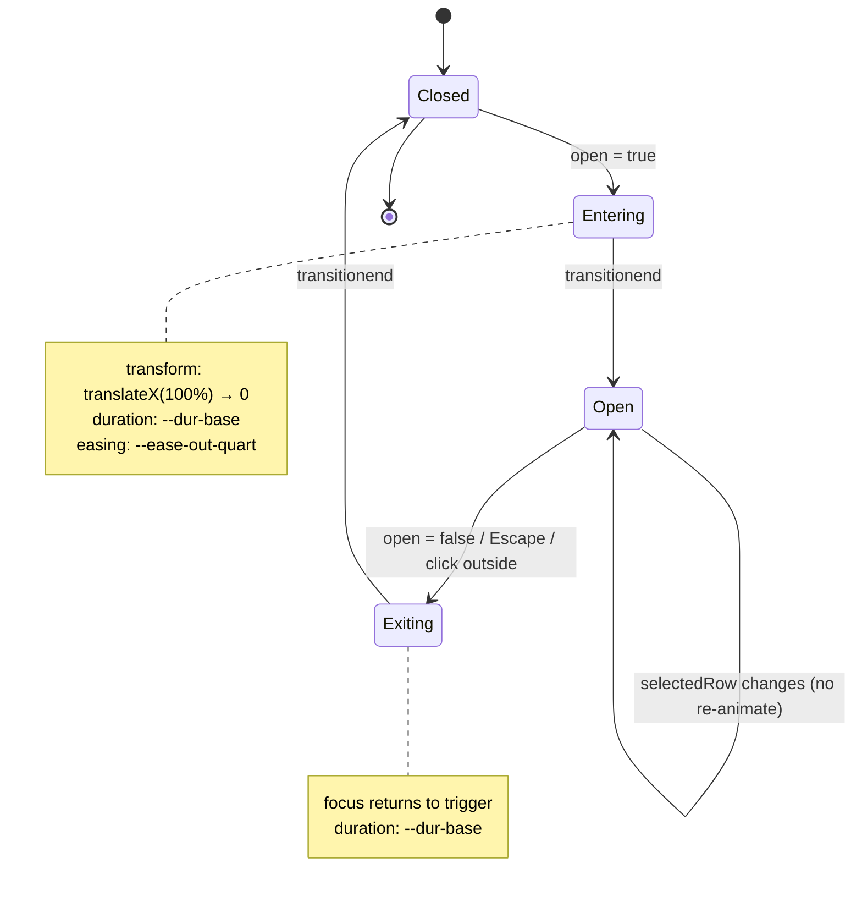

# Design Document

## Overview

本设计文档描述 **AI Skills Manager** 的前端 UI 与交互重设计方案，落地 `requirements.md` 中约定的 Linear 风格克制工作台，不改变 Tauri 后端命令契约（见 `src/api/index.ts`）。本次重设计覆盖五项核心产物：

1. **App_Shell 架构**：一个稳定的三段式桌面外壳（`Primary_Nav` + `Workspace_Header` + `Workspace_Body`），替换 `src/App.tsx` 目前基于字符串状态切换的简易布局。
2. **Design_Token 系统**：以 CSS 变量为唯一真相源 + Tailwind `theme.extend` 消费，外加 `design/tokens.json` 产物，覆盖色彩、字号、行高、间距、圆角、阴影、动效。
3. **通用组件库**：`List_Row`、`Detail_Panel`、`Empty_State`、`Toast`、`Button`/`IconButton`、`TextField`、`Select`、`Switch`、`Checkbox`、`Tooltip`、`Badge`，外加可选的 `Command_Bar`。
4. **页面重构**：`Discovery` / `MySkills` / `Tools` / `Migrate` / `Settings` 五个页面按新组件与新 Shell 重新组合，移除 `SkillCard` / `ToolCard` / 现有 `Sidebar` 的卡片式视觉。
5. **动效与主题系统**：统一的 `Motion_System`，结合 `prefers-reduced-motion` 与 `prefers-color-scheme` 响应系统设置；通过根元素 `data-theme` 切换主题。

### 设计原则

- **信息优先，装饰归零**：取消阴影、渐变、彩色图标背景；密集列表 + 详情面板作为主交互范式。
- **单一强调色**：`accent` 是唯一品牌色，用于活动态、主操作、焦点环；其余全部灰阶。
- **桌面优先**：最小 800×600，不适配移动端；键盘可达是基础而非加分项。
- **令牌即契约**：所有 px、颜色、时长都从令牌系统读取，禁止在组件内硬编码样式值。
- **可测性**：UI 渲染用快照/视觉回归，纯逻辑（主题解析、路径截断、toast 队列、筛选、响应式断点）用 property-based testing。

### 研究摘要

- **Linear 风格参考**：Linear 的 workspace 采用固定左栏 + 顶部 breadcrumb + 密集列表的组合，活动态用 2px 左指示条而非整块背景，强调色面积极小。本设计沿用该范式。
- **Radix UI / cmdk**：社区成熟的无样式原语库。`Command_Bar` 建议基于 [`cmdk`](https://cmdk.paco.me) 封装；`Tooltip` / `Switch` / `Checkbox` / `Select` 建议基于 [`@radix-ui/react-*`](https://www.radix-ui.com/) 封装以直接获得 ARIA 与键盘行为。`Primary_Nav` 使用原生 `<nav>` + `<button>`，不引入 Radix。
- **Tauri 集成约束**：`@tauri-apps/api@1.5`（见 `package.json`）的 `invoke` 契约保持不变；页面重构只替换 UI 层组件，不触碰 `src/api/index.ts` 以外的调用点。
- **系统字体栈**：桌面端统一使用 `-apple-system, BlinkMacSystemFont, "Segoe UI", Roboto, Helvetica, Arial, sans-serif`，mono 使用 `ui-monospace, SFMono-Regular, Menlo, Consolas, monospace`，无需加载 webfont，首屏时间可控。

---

## Architecture

### App_Shell 组件树

```mermaid
graph TD
  App[App.tsx]
  App --> Providers[AppProviders]
  Providers --> ThemeProvider
  Providers --> ToastProvider
  Providers --> CommandBarProvider[(optional) CommandBarProvider]
  Providers --> Router[AppShell]

  Router --> Nav[Primary_Nav]
  Router --> Main[WorkspaceLayout]

  Main --> Header[Workspace_Header]
  Main --> Body[Workspace_Body]
  Main --> DetailSlot[Detail_Panel slot]

  Body --> Page{activePage}
  Page --> Discovery[DiscoveryPage]
  Page --> MySkills[MySkillsPage]
  Page --> Tools[ToolsPage]
  Page --> Migrate[MigratePage]
  Page --> Settings[SettingsPage]

  Router --> Toasts[ToastViewport]
  Router --> Cmd[CommandBarOverlay]
```

### 目录结构（src/）

重构后目录如下。保留 `src/api/index.ts`、`src/types/index.ts`、`src/main.tsx` 不变；`src/App.tsx` 只保留薄壳装配。

```
src/
├── App.tsx                         # 装配 AppProviders + AppShell
├── main.tsx                        # 不变
├── index.css                       # 引入 tokens.css + tailwind base/components/utilities
├── api/
│   └── index.ts                    # 不变（Tauri command 契约）
├── types/
│   └── index.ts                    # 不变（Skill/AITool/LocalSkill/SkillLink）
├── shell/
│   ├── AppShell.tsx                # 三段式布局 + 键盘快捷键注册
│   ├── AppProviders.tsx            # ThemeProvider / ToastProvider / CommandBarProvider 组合
│   ├── PrimaryNav.tsx              # 左侧主导航
│   ├── WorkspaceHeader.tsx         # 顶部标题 + 元信息 + 操作槽
│   ├── WorkspaceBody.tsx           # 主内容 + DetailPanel 槽
│   └── DetailPanel.tsx             # 右侧推入/覆盖式面板
├── components/
│   ├── primitives/                 # 无业务语义的原子组件
│   │   ├── Button.tsx
│   │   ├── IconButton.tsx
│   │   ├── TextField.tsx
│   │   ├── Select.tsx
│   │   ├── Switch.tsx
│   │   ├── Checkbox.tsx
│   │   ├── Tooltip.tsx
│   │   ├── Badge.tsx
│   │   └── Skeleton.tsx
│   ├── patterns/                   # 组合模式组件
│   │   ├── ListRow.tsx
│   │   ├── EmptyState.tsx
│   │   └── Toast.tsx
│   └── command/                    # 可选功能
│       └── CommandBar.tsx
├── pages/
│   ├── DiscoveryPage.tsx
│   ├── MySkillsPage.tsx
│   ├── ToolsPage.tsx
│   ├── MigratePage.tsx
│   └── SettingsPage.tsx
├── hooks/
│   ├── useTheme.ts                 # System/Light/Dark 解析 + data-theme 应用
│   ├── useToast.ts                 # Toast 队列 API
│   ├── useBreakpoint.ts            # 返回 narrow | compact | regular
│   ├── useKeyboardShortcuts.ts     # Cmd/Ctrl+1..5、Cmd/Ctrl+K、Escape
│   └── useReducedMotion.ts         # prefers-reduced-motion 订阅
├── lib/
│   ├── theme.ts                    # resolveTheme(prefer, systemIsDark) 纯函数
│   ├── breakpoint.ts               # classifyWidth(px) 纯函数
│   ├── truncate.ts                 # middleEllipsis(path, maxChars) 纯函数
│   ├── toastQueue.ts               # 队列 reducer（enqueue/dequeue/timeout）
│   ├── filter.ts                   # filterSkills(list, query, sourceType) 纯函数
│   └── motion.ts                   # 从令牌读取 durations/easings
└── design/
    ├── tokens.css                  # :root + [data-theme="dark"] 的 CSS 变量
    └── tokens.json                 # 供 Tailwind config 消费的产物
```

### 主要架构决策

| 决策 | 方案 | 理由 |
|---|---|---|
| 路由 | 保留现有 `activePage` 状态（字符串枚举），不引入 `react-router-dom` 运行时路由 | 依赖已在 `package.json` 但实际无需多级路由；字符串枚举足以满足 5 个一级目的地，便于快捷键映射 |
| 主题 | CSS 变量 + `data-theme` 属性 | 单属性切换，无闪烁；Tailwind 仅作为工具类消费 var |
| 状态管理 | React hooks + context，不引入 Redux/Zustand | 本地/会话态为主，跨页共享仅为主题与 toast |
| 无样式原语 | Radix UI（Tooltip/Switch/Checkbox/Select） | 免费拿到 ARIA 与键盘行为，避免重复造轮子 |
| 图标 | `lucide-react`（已在依赖中） | 线性图标统一风格，与 Linear 美学匹配 |
| 动效 | 纯 CSS transition + `@media (prefers-reduced-motion)` | 不引入 framer-motion；所有过渡都在令牌时长/缓动内 |

---

## Components and Interfaces

### Design_Token：CSS 变量

`src/design/tokens.css` 是唯一真相源。Tailwind 通过 `theme.extend` 读取同一组变量。

```css
/* src/design/tokens.css */
:root,
:root[data-theme="light"] {
  /* color — light */
  --color-canvas: #FAFAFA;
  --color-surface: #FFFFFF;
  --color-surface-raised: #F4F4F5;
  --color-border-subtle: #EAEAEA;
  --color-border-default: #D4D4D8;
  --color-border-strong: #A1A1AA;
  --color-text-primary: #18181B;
  --color-text-secondary: #52525B;
  --color-text-tertiary: #A1A1AA;
  --color-accent: #5E6AD2;          /* Linear-style indigo */
  --color-accent-hover: #4F5BC4;
  --color-accent-foreground: #FFFFFF;
  --color-success: #15803D;
  --color-warning: #B45309;
  --color-danger: #B91C1C;

  /* typography */
  --font-sans: -apple-system, BlinkMacSystemFont, "Segoe UI", Roboto, Helvetica, Arial, sans-serif;
  --font-mono: ui-monospace, SFMono-Regular, Menlo, Consolas, monospace;
  --fs-12: 12px; --lh-12: 16px;
  --fs-13: 13px; --lh-13: 18px;
  --fs-14: 14px; --lh-14: 20px;
  --fs-16: 16px; --lh-16: 24px;
  --fs-20: 20px; --lh-20: 28px;
  --fs-28: 28px; --lh-28: 36px;

  /* spacing (4px grid) */
  --space-1: 4px;
  --space-2: 8px;
  --space-3: 12px;
  --space-4: 16px;
  --space-5: 20px;
  --space-6: 24px;
  --space-8: 32px;
  --space-12: 48px;
  --space-16: 64px;

  /* radius */
  --radius-sm: 4px;
  --radius-md: 6px;
  --radius-lg: 8px;
  --radius-full: 9999px;   /* 仅用于头像与 Switch */

  /* shadow */
  --shadow-none: 0 0 #0000;
  --shadow-overlay: 0 8px 24px rgba(0, 0, 0, 0.12), 0 2px 6px rgba(0, 0, 0, 0.08);

  /* motion */
  --dur-fast: 120ms;
  --dur-base: 180ms;
  --dur-slow: 240ms;
  --ease-out-quart: cubic-bezier(0.25, 1, 0.5, 1);
  --ease-in-out-quart: cubic-bezier(0.76, 0, 0.24, 1);

  /* layout */
  --nav-width-expanded: 224px;
  --nav-width-collapsed: 56px;
  --shell-pad-x: 32px;
  --shell-pad-top: 24px;
  --shell-pad-bottom: 48px;
  --list-row-height: 48px;
}

:root[data-theme="dark"] {
  --color-canvas: #0B0B0D;
  --color-surface: #111114;
  --color-surface-raised: #1A1A1F;
  --color-border-subtle: #1F1F24;
  --color-border-default: #2A2A30;
  --color-border-strong: #52525B;
  --color-text-primary: #F4F4F5;
  --color-text-secondary: #A1A1AA;
  --color-text-tertiary: #71717A;
  --color-accent: #8B95E5;
  --color-accent-hover: #A3ABEE;
  --color-accent-foreground: #0B0B0D;
  --color-success: #4ADE80;
  --color-warning: #FBBF24;
  --color-danger: #F87171;
  --shadow-overlay: 0 8px 24px rgba(0, 0, 0, 0.48), 0 2px 6px rgba(0, 0, 0, 0.32);
}

@media (prefers-reduced-motion: reduce) {
  :root {
    --dur-fast: 0ms;
    --dur-base: 0ms;
    --dur-slow: 0ms;
  }
}
```

macOS 红绿灯避让通过 CSS 特性查询在 `AppShell` 内应用：

```css
@supports (-webkit-backdrop-filter: blur(0)) {
  .app-shell[data-platform="macos"] .primary-nav { padding-top: 28px; }
}
```

### Tailwind theme.extend

`tailwind.config.js` 扩展为消费 CSS 变量。业务样式统一写 Tailwind 工具类（如 `bg-canvas text-primary`），不写原生 style。

```js
// tailwind.config.js
export default {
  content: ["./index.html", "./src/**/*.{ts,tsx}"],
  theme: {
    extend: {
      colors: {
        canvas: "var(--color-canvas)",
        surface: "var(--color-surface)",
        "surface-raised": "var(--color-surface-raised)",
        "border-subtle": "var(--color-border-subtle)",
        "border-default": "var(--color-border-default)",
        "border-strong": "var(--color-border-strong)",
        "text-primary": "var(--color-text-primary)",
        "text-secondary": "var(--color-text-secondary)",
        "text-tertiary": "var(--color-text-tertiary)",
        accent: "var(--color-accent)",
        "accent-hover": "var(--color-accent-hover)",
        "accent-fg": "var(--color-accent-foreground)",
        success: "var(--color-success)",
        warning: "var(--color-warning)",
        danger: "var(--color-danger)",
      },
      fontFamily: {
        sans: "var(--font-sans)",
        mono: "var(--font-mono)",
      },
      fontSize: {
        "12": ["var(--fs-12)", { lineHeight: "var(--lh-12)" }],
        "13": ["var(--fs-13)", { lineHeight: "var(--lh-13)" }],
        "14": ["var(--fs-14)", { lineHeight: "var(--lh-14)" }],
        "16": ["var(--fs-16)", { lineHeight: "var(--lh-16)" }],
        "20": ["var(--fs-20)", { lineHeight: "var(--lh-20)" }],
        "28": ["var(--fs-28)", { lineHeight: "var(--lh-28)" }],
      },
      spacing: {
        "1": "var(--space-1)",
        "2": "var(--space-2)",
        "3": "var(--space-3)",
        "4": "var(--space-4)",
        "5": "var(--space-5)",
        "6": "var(--space-6)",
        "8": "var(--space-8)",
        "12": "var(--space-12)",
        "16": "var(--space-16)",
      },
      borderRadius: {
        sm: "var(--radius-sm)",
        md: "var(--radius-md)",
        lg: "var(--radius-lg)",
        full: "var(--radius-full)",
      },
      boxShadow: {
        none: "var(--shadow-none)",
        overlay: "var(--shadow-overlay)",
      },
      transitionDuration: {
        fast: "var(--dur-fast)",
        base: "var(--dur-base)",
        slow: "var(--dur-slow)",
      },
      transitionTimingFunction: {
        "out-quart": "var(--ease-out-quart)",
        "in-out-quart": "var(--ease-in-out-quart)",
      },
    },
  },
  plugins: [],
};
```


### Shell Components

#### `AppShell`

位置：`src/shell/AppShell.tsx`。装配整个桌面外壳并注册全局快捷键。

```ts
type PageId = 'discovery' | 'my-skills' | 'tools' | 'migrate' | 'settings';

interface AppShellProps {
  platform: 'macos' | 'windows' | 'linux';
  initialPage?: PageId;
}
```

- 结构：`<div class="app-shell" data-platform={platform}>` 包裹 `PrimaryNav` 与 `WorkspaceLayout`（= `WorkspaceHeader` + `WorkspaceBody`），底部挂载 `ToastViewport` 与可选 `CommandBarOverlay`。
- 状态：持有 `activePage: PageId`、`navCollapsed: boolean`（随 `useBreakpoint` 响应）、`detailOpen: boolean`、`detailLayout: 'push' | 'overlay'`（窗口 < 900 且 detail 打开时切 overlay）。
- 快捷键：通过 `useKeyboardShortcuts` 注册 `Cmd/Ctrl+1..5`、`Cmd/Ctrl+K`、`Escape`；非输入元素焦点时才触发数字键。
- a11y：根节点 `<div role="application">` 不加，改用语义化子元素（`<nav>`、`<main>`、`<aside>`）。
- 响应式：规则见 `WorkspaceBody` 与 Requirement 15。

#### `PrimaryNav`

位置：`src/shell/PrimaryNav.tsx`。左侧主导航，替代 `src/components/Sidebar.tsx`。

```ts
interface PrimaryNavItem {
  id: PageId;
  label: string;
  icon: React.ComponentType<{ size?: number }>;
  shortcut: string;        // e.g. "⌘1"
  hasUnread?: boolean;
}

interface PrimaryNavProps {
  items: readonly PrimaryNavItem[];
  activeId: PageId;
  collapsed: boolean;
  onNavigate: (id: PageId) => void;
}
```

- 结构：`<nav aria-label="Primary">` 包裹 `<ul>`，每项为 `<button role="tab" aria-current={active ? 'page' : undefined}>`。
- 视觉：活动项 2px 左指示条（`border-l-[2px] border-accent`）+ `text-accent` 前景，其余 `text-secondary`；无整块背景高亮。
- Collapsed 态（`width: 56px`）：隐藏 label，保留 24px 图标居中，`Tooltip` 通过 hover 400ms 展示 `${label} · ${shortcut}`。
- 未读指示：项右侧 8px 单色圆点，颜色 `accent`（展开态位于 label 尾部，折叠态位于图标右上）。
- 键盘：Tab 进入首项后，ArrowDown/ArrowUp 在项间移动焦点，Enter/Space 触发 `onNavigate`。
- macOS 顶部留白 28px：由 `AppShell` 通过 CSS 特性查询注入，组件本身不判断。

#### `WorkspaceHeader`

位置：`src/shell/WorkspaceHeader.tsx`。每页顶部标题栏。

```ts
interface WorkspaceHeaderProps {
  title: string;                         // H1
  meta?: React.ReactNode;                // 单行文本，≤120 字符
  leading?: React.ReactNode;             // 可选 back/breadcrumb
  search?: React.ReactNode;              // TextField 实例，≤320px
  filters?: React.ReactNode;             // 至多 2 个并排控件
  primaryActions?: readonly React.ReactNode[]; // 至多 2 个 Button
}
```

- 排版：两行布局。第一行：`leading` + `<h1 class="text-20 font-semibold text-primary">`（左）+ `primaryActions`（右）；第二行：`meta`（左）+ `search` + `filters`（右）。
- 内边距：上下 24px（来自 `--shell-pad-top`），左右 32px，底部 1px `border-subtle` 分隔 `WorkspaceBody`。
- 过载防御：组件内 `useEffect` 在开发模式下对 `meta` 做 `>120` 字符告警；`primaryActions.length > 2` 时 `console.error` 并只渲染前两个。
- a11y：`<header role="banner">` 不用（banner 留给文档级）；使用 `<header>` 原生语义即可。

#### `WorkspaceBody`

位置：`src/shell/WorkspaceBody.tsx`。主内容 + Detail 槽。

```ts
interface WorkspaceBodyProps {
  children: React.ReactNode;           // 主内容区
  detail?: React.ReactNode;            // DetailPanel 实例或 null
  detailOpen: boolean;
  layout: 'push' | 'overlay';          // 由 AppShell 根据断点决定
}
```

- 布局：`layout="push"` 时使用 CSS grid `grid-template-columns: 1fr auto`，detail 列宽度 `clamp(360px, 40%, 480px)`；`layout="overlay"` 时 detail 绝对定位覆盖主区 70%。
- 过渡：grid 列宽与 detail transform 使用 `transition-[grid-template-columns,transform] duration-base ease-out-quart`。
- 滚动：主内容区自身 `overflow-y: auto`，避免 Shell 整体滚动。
- 响应式：
  - `width ≥ 1024`：`PrimaryNav` 展开（224px），push 布局。
  - `768 ≤ width < 1024`：`PrimaryNav` 折叠（56px），push 布局。
  - `width < 900 && detailOpen`：切 overlay（由 AppShell 控制）。
  - `width < 800`：`PrimaryNav` 变 overlay（见 Requirement 15.5）。

### Primitives and Patterns

所有原语位置 `src/components/primitives/*`；组合模式位置 `src/components/patterns/*`。下列 prop 类型为权威契约，实现使用 `forwardRef` 并合并 `className`。

#### `Button`

```ts
type ButtonVariant = 'primary' | 'secondary' | 'ghost' | 'danger';
type ButtonSize = 'sm' | 'md';

interface ButtonProps
  extends Omit<React.ButtonHTMLAttributes<HTMLButtonElement>, 'children'> {
  variant?: ButtonVariant;     // default 'secondary'
  size?: ButtonSize;           // default 'md'
  loading?: boolean;           // 显示 16px 旋转指示，同时 disabled
  leadingIcon?: React.ReactNode;
  trailingIcon?: React.ReactNode;
  children: React.ReactNode;
}
```

- 视觉：`primary` 使用 `bg-accent text-accent-fg hover:bg-accent-hover`；`secondary` 使用 `border border-border-default text-text-primary`；`ghost` 无边框无背景；`danger` 使用 `border-danger text-danger`。
- 尺寸：`sm` 高 28px，`md` 高 32px；一律 `rounded-md`，无投影，无渐变。
- 焦点：`focus-visible:ring-2 focus-visible:ring-accent focus-visible:ring-offset-2 focus-visible:ring-offset-canvas`。
- Loading：替换 `leadingIcon` 为 `Loader2` 旋转图标，旋转由 `@keyframes spin` 驱动，`prefers-reduced-motion` 下停止旋转但保留图标。

#### `IconButton`

```ts
interface IconButtonProps
  extends Omit<React.ButtonHTMLAttributes<HTMLButtonElement>, 'children' | 'aria-label'> {
  icon: React.ReactNode;
  'aria-label': string;        // required
  size?: 'sm' | 'md';          // 28px / 32px，图标 16px / 20px
  variant?: 'ghost' | 'subtle';
  loading?: boolean;
}
```

- 必须 `aria-label`；未提供时 TypeScript 报错（contract 层面）。
- `subtle` 变体 hover 背景为 `surface-raised`；`ghost` 无 hover 背景。

#### `TextField`

```ts
interface TextFieldProps {
  id?: string;
  value: string;
  onChange: (value: string) => void;
  onSubmit?: (value: string) => void;   // Enter 触发
  placeholder?: string;
  label?: string;                       // 关联 <label for>
  helperText?: string;
  error?: string;
  leadingIcon?: React.ReactNode;
  trailingSlot?: React.ReactNode;       // 清除按钮等
  size?: 'sm' | 'md';                   // 28 / 32
  type?: 'text' | 'search';
  disabled?: boolean;
  autoFocus?: boolean;
  maxLength?: number;
}
```

- 视觉：1px `border-default`，无圆形胶囊（`rounded-md`）。`error` 存在时边框换 `border-danger`，下方显示 `text-12 text-danger`。
- a11y：`error` 通过 `aria-invalid="true"` + `aria-describedby` 指向错误节点。

#### `Select`

基于 `@radix-ui/react-select` 封装。

```ts
interface SelectOption<T extends string = string> {
  value: T;
  label: string;
  disabled?: boolean;
}

interface SelectProps<T extends string = string> {
  id?: string;
  value: T;
  onChange: (value: T) => void;
  options: readonly SelectOption<T>[];
  placeholder?: string;
  disabled?: boolean;
  size?: 'sm' | 'md';
}
```

- Trigger 与 `TextField` 同高同边框。Content 使用 `shadow-overlay` + `border-border-subtle`。
- 键盘：Radix 内建 ArrowUp/Down、Home/End、首字母跳转。

#### `Switch`

基于 `@radix-ui/react-switch`。

```ts
interface SwitchProps {
  checked: boolean;
  onChange: (checked: boolean) => void;
  disabled?: boolean;
  'aria-label': string;
  size?: 'sm' | 'md';          // 20×12 / 24×14
}
```

- Thumb 为 `rounded-full`（例外：允许胶囊形，符合 token 约束）。Track 关态 `bg-border-default`，开态 `bg-accent`。

#### `Checkbox`

基于 `@radix-ui/react-checkbox`。

```ts
interface CheckboxProps {
  id?: string;
  checked: boolean | 'indeterminate';
  onChange: (checked: boolean) => void;
  disabled?: boolean;
  'aria-label'?: string;
  label?: string;
}
```

- 16×16，`rounded-sm`，1px `border-border-default`。选中 `bg-accent border-accent`，内部白色 check 图标。

#### `Tooltip`

基于 `@radix-ui/react-tooltip`。

```ts
interface TooltipProps {
  content: React.ReactNode;    // 通常短字符串；长字符串不建议
  side?: 'top' | 'right' | 'bottom' | 'left';
  align?: 'start' | 'center' | 'end';
  delayMs?: number;            // default 400（符合 Requirement 3.3）
  children: React.ReactElement; // 触发器必须是单一元素
  disabled?: boolean;
}
```

- 背景 `bg-text-primary text-canvas text-12`，`rounded-sm`，padding `2px 6px`，无箭头装饰。

#### `Badge`

```ts
type BadgeVariant = 'neutral' | 'accent' | 'success' | 'warning' | 'danger';

interface BadgeProps {
  variant?: BadgeVariant;      // default 'neutral'
  children: React.ReactNode;
}
```

- 尺寸：高 18px，`text-12`，padding `0 6px`，`rounded-sm`，仅 1px 边框 + 同色文字（例如 `border-danger text-danger`），无填充。

#### `Skeleton`

```ts
interface SkeletonProps {
  width?: number | string;      // default '100%'
  height?: number | string;     // default 12
  shape?: 'rect' | 'line';      // 'line' 即高度 1em
  className?: string;
}
```

- 视觉：`bg-border-subtle`，无彩色闪动；若 `prefers-reduced-motion: no-preference`，使用 1000ms 单向透明度循环 `opacity: 1 → 0.5 → 1`。

#### `ListRow`

位置：`src/components/patterns/ListRow.tsx`。

```ts
interface ListRowProps {
  id: string;
  leading?: React.ReactNode;                 // 开关 / 复选框 / 图标
  primary: React.ReactNode;                  // 主标题
  secondary?: React.ReactNode;               // 仅 hover 显示
  meta?: readonly React.ReactNode[];         // 最多 2 项
  trailing?: React.ReactNode;                // 行级操作，仅 hover 显示
  selected?: boolean;
  disabled?: boolean;
  loading?: boolean;                         // skeleton 占位
  density?: 'compact' | 'regular';           // default 'regular' (48px)
  onSelect?: (id: string) => void;
  onKeyNav?: (direction: 'up' | 'down') => void;
  href?: string;                             // 若提供渲染为 <a>，否则 <div role="row">
}
```

- 布局：grid `auto | 1fr | auto-auto | auto`，列分别是 leading、primary+secondary、meta…、trailing。
- 语义：容器 `role="row"`，内嵌可交互元素为原生 `button`/`input`（符合 Requirement 14.4）。
- 活动态：`selected` 时 `border-l-2 border-accent bg-surface-raised`。
- Hover：`hover:bg-surface-raised`，`trailing` 与 `secondary` 从 `opacity-0` 过渡到 `opacity-100`，时长 `fast=120ms`。
- Loading：整行替换为三块 `Skeleton`（leading 16×16、primary 70%、trailing 60×16）。
- 键盘：ArrowUp/ArrowDown 调用 `onKeyNav`；Enter 调用 `onSelect`；Space 切换内嵌 `Checkbox`。

#### `DetailPanel`

位置：`src/shell/DetailPanel.tsx`。

```ts
interface DetailPanelProps {
  open: boolean;
  onClose: () => void;
  title: React.ReactNode;
  subtitle?: React.ReactNode;
  footer?: React.ReactNode;        // 主操作区，底部固定
  children: React.ReactNode;       // panel-body
  ariaLabel?: string;              // default 'Details'
  layout?: 'push' | 'overlay';     // 由 WorkspaceBody 传入
}
```

- 结构：`<aside role="complementary" aria-label={ariaLabel}>` 包裹 `<header class="panel-header">`、`<div class="panel-body overflow-y-auto">`、`<footer class="panel-footer">`。
- 焦点：`open: false → true` 时自动聚焦关闭按钮；`open: true → false` 时焦点还原到打开它的触发器（由调用方传入 `previousFocusRef` 或组件内部用 `useRef` 捕获）。
- 行切换：`open` 为 `true` 期间更新 `children` 不重播进入动画（用内部 `hasEnteredRef` 标记）。
- ESC / 点外关闭：绑定 `keydown` 与主区 `pointerdown` 监听；overlay 模式下点外 = 主区可见部分。

状态机如下：



#### `EmptyState`

```ts
interface EmptyStateProps {
  title: string;
  description?: string;
  icon?: React.ReactNode;                    // 16px 单色，可省略
  primaryAction?: { label: string; onClick: () => void };
  secondaryAction?:
    | { label: string; onClick: () => void }
    | { label: string; href: string; external?: boolean };
  align?: 'left' | 'center';                 // default 'left'
}
```

- 左对齐优先（Requirement 4.2）。`center` 只在极少数语义真正居中的场景用。
- 禁止装饰性大图标；`icon` 尺寸恒为 16px。
- `secondary.href` + `external: true` 时渲染 `<a target="_blank" rel="noreferrer">`。

#### `Toast` & `ToastViewport`

```ts
type ToastVariant = 'info' | 'success' | 'warning' | 'error';

interface ToastPayload {
  id: string;                  // 由 useToast 生成
  variant: ToastVariant;
  title: string;
  description?: string;
  durationMs?: number;         // default 4000；传 0 表示手动关闭
  action?: { label: string; onClick: () => void };
}

interface ToastProps extends ToastPayload {
  onDismiss: (id: string) => void;
}
```

- 视口位置右下角，距边 16px，纵向堆叠，最多同时显示 3 条（见 Requirement 16.5），溢出按 FIFO 出队。
- 语义：`info` / `success` 使用 `role="status"` + `aria-live="polite"`；`warning` / `error` 使用 `role="alert"` + `aria-live="assertive"`。
- 视觉：1px 同色边框 + `text-{variant}` 前景，无填充背景；关闭按钮为 `IconButton`。

#### `CommandBar`（optional）

位置：`src/components/command/CommandBar.tsx`，底层 `cmdk`。

```ts
interface CommandItem {
  id: string;
  label: string;
  keywords?: readonly string[];
  group: 'Navigate' | 'Tools' | 'Skills' | 'Theme';
  shortcut?: string;
  perform: () => void | Promise<void>;
}

interface CommandBarProps {
  open: boolean;
  onOpenChange: (open: boolean) => void;
  commands: readonly CommandItem[];
}
```

- 唤起：`Cmd/Ctrl+K`（注册在 `AppShell`）。关闭：`Escape` 或点外。
- 焦点：打开时聚焦输入框；关闭时还原到前一聚焦元素。
- 视觉：居上 overlay，宽 560px，使用 `shadow-overlay`，无毛玻璃。


### Hooks 契约

| Hook | 签名 | 责任 |
|---|---|---|
| `useTheme()` | `{ preference: 'system'|'light'|'dark'; setPreference(p): void; resolved: 'light'|'dark' }` | 订阅 `matchMedia('(prefers-color-scheme: dark)')`，将 `resolved` 写入 `document.documentElement.dataset.theme`；`preference` 持久化到 `localStorage` `ui.theme`。 |
| `useToast()` | `{ toast(payload): string; dismiss(id): void; toasts: ToastPayload[] }` | 队列由纯函数 `lib/toastQueue.ts` 管理，最大长度 3；返回的 `id` 允许调用方手动 dismiss。 |
| `useBreakpoint()` | `'narrow'|'compact'|'regular'` | 基于 `matchMedia` 监听 800/1024 两个断点；SSR 不适用，组件挂载时初始化。 |
| `useKeyboardShortcuts(map)` | `(map: Record<string, (e)=>void>) => void` | 单点注册 `keydown`；input/textarea/contenteditable 焦点时只放行 `Escape` 与 `Cmd/Ctrl+K`。 |
| `useReducedMotion()` | `boolean` | 订阅 `matchMedia('(prefers-reduced-motion: reduce)')`，作为纯 JS 逻辑的旁路（CSS 已由 `@media` 覆盖）。 |

### 页面组合规范

以下 5 页统一的骨架：每页默认导出 `function PageName()`，内部 `return` 形如
`<><WorkspaceHeader … /><WorkspaceBody detail={detailNode} detailOpen={open} layout={layout}>…</WorkspaceBody></>`。
Header / Body 由页面直接使用，`DetailPanel` 在 Body 的 `detail` 槽中渲染。

#### `DiscoveryPage`

- 数据：当前无对应后端命令；页面内 `const skills: Skill[] = []` 作为静态桩（零项）。
- Header：`title="Discovery"`；`meta="Browse and install community Skills"`；`search=<TextField size="sm" type="search" value={q} onChange={setQ} leadingIcon={<Search size={14} />} placeholder="Search Skills" />`（宽度 ≤ 320px）。
- Body：当 `skills.length === 0` 渲染 `<EmptyState align="left" title="No Skills yet" description="Discovery is under construction. Browse community Skills on skills.sh in the meantime." secondaryAction={{ label: 'Open skills.sh', href: 'https://skills.sh', external: true }} />`；`q` 非空但 `skills` 仍为 0 时文案包含 `"No results for '{q}'"` 与 `primaryAction={{ label: 'Clear search', onClick: () => setQ('') }}`。
- Detail：暂不启用。
- 映射需求：4.1 / 4.2 / 4.4 / 4.5。

#### `MySkillsPage`

- 数据：`useEffect(() => { getSkills().then(setSkills).catch(setError) }, [refreshTick])`；`refreshTick` 由内部 actions 递增。
- 派生视图：`const visible = filterSkills(skills, q, sourceType)`；`filterSkills` 定义于 `lib/filter.ts`，对 `skills` 数组做纯筛选（名称/作者/描述包含 `q`，`source_type === sourceType` 或 `'all'`）。
- Header：`title="My Skills"`；`meta="{visible.length} of {skills.length} · {enabledCount} enabled · Updated {relativeTime(lastSyncAt)}"`；`search`=同 Discovery；`filters=[<Select options={sourceOptions} … />]`；`primaryActions=[<IconButton icon={<RefreshCw />} aria-label="Refresh" onClick={refresh} />]`。
- Body：
  - `loading && skills.length === 0` → 渲染 8 行 `<ListRow loading />` 骨架；
  - `error` → 顶部 inline 错误条（见错误处理）；
  - `!loading && visible.length === 0 && skills.length > 0` → `<EmptyState title="No matches" description="Try a different keyword or clear filters" primaryAction={{ label: 'Clear filters', onClick: clearFilters }} />`；
  - `skills.length === 0` → `<EmptyState title="No Skills installed" description="Install from Discovery or migrate from a local tool" secondaryAction={{ label: 'Go to Migrate', onClick: () => navigate('migrate') }} />`；
  - 其他 → `<ul role="rowgroup">`，每项 `<ListRow leading={<Switch />} primary={name} secondary={description} meta={[sourceBadge, version, relativeTime(updatedAt)]} trailing={<IconButton icon={<MoreHorizontal />} aria-label="Actions" />} selected={selectedId===id} onSelect={openDetail} />`。
- Detail：`DetailPanel` 显示完整元数据；footer 为 `<Button variant="danger">Uninstall</Button>`（点击展开 Popover 做二次确认）与 `<Button variant="ghost">Open folder</Button>`。
- 交互：
  - Toggle 失败回滚：`await toggleSkill(id, !prev)` 抛错时 `setSkills(prevSnapshot); toast({ variant: 'error', title: 'Failed to toggle', description: err.message })`；
  - Uninstall 二次确认：使用 `@radix-ui/react-popover`，确认后调用 `uninstallSkill(id)`，成功后 `toast({ variant: 'success', title: 'Uninstalled', description: name })` 并关闭 `DetailPanel`。
- 映射需求：5.1–5.10、9.1–9.6、16.1–16.4。

#### `ToolsPage`

- 数据：`getTools()` 初始；`detectTools()` 按钮触发；两者返回 `AITool[]`。
- Header：`title="Tools"`；`meta="{detectedCount} detected · {enabledCount} enabled"`；`primaryActions=[<Button variant="primary" leadingIcon={<ScanLine />} loading={detecting} onClick={redetect}>Re-detect</Button>]`。
- Body：
  - `tools.length === 0` → `<EmptyState title="No tools detected" description="Click Re-detect or set a custom path" primaryAction={{ label: 'Re-detect', onClick: redetect }} />`；
  - 其他 → `<ListRow leading={<Switch disabled={!tool.is_detected} />} primary={name} meta={[detectedBadge, <code>{middleEllipsis(config_path, 40)}</code>]} trailing={<IconButton icon={<FolderOpen />} aria-label="Open path" onClick={openPath} />} />`。
- 视觉：`detectedBadge` = `<Badge variant={tool.is_detected ? 'success' : 'neutral'}>{tool.is_detected ? 'Detected' : 'Not found'}</Badge>`（仅描边+文字，无填充）。
- 路径 Tooltip：`<Tooltip content={config_path}><code>…</code></Tooltip>`；`openPath` 调用（预留）`invoke('open_path', { path: config_path })`，此命令本次实现为 `console.log`（占位），不计入 requirements.md 第 17.3 条的契约范围。
- 映射需求：6.1–6.7。

#### `MigratePage`

- 数据：`getTools()` 过滤 `is_detected`；`scanLocalSkills(toolId)` 返回 `LocalSkill[]`；`migrateLocalSkill(path, skillId)` 单条迁移。
- Header：`title="Migrate"`；`meta="Import Skills from a detected tool's folder"`。
- Control row（Header 下方 16px，属于 Body 顶部）：`<Select value={toolId} options={toolOptions} />` + `<Button variant="primary" leadingIcon={<Search size={14} />} loading={scanning} disabled={!toolId} onClick={scan}>Scan</Button>`；`!toolId` 时旁边显示 `<span class="text-13 text-text-tertiary">Select a detected tool first. Go to Tools to detect.</span>`。
- Body：
  - 列表顶部粘性工具条（仅在 `selected.size > 0` 显示）：`<Checkbox checked={allChecked} onChange={toggleAll} label="Select all" />` + `Selected {n}` + 右侧 `<Button variant="primary" leadingIcon={<ArrowRight size={14} />} loading={migrating}>Migrate selected ({n})</Button>` + `<Button variant="ghost">Clear</Button>`；
  - `<ListRow leading={<Checkbox checked={selected.has(path)} onChange={() => toggle(path)} />} primary={name} meta={[<code>{middleEllipsis(path, 48)}</code>, is_symlink ? <Badge variant="warning">Symlink</Badge> : null]} trailing={rowStatus[path] === 'error' ? <button class="text-13 text-danger underline" onClick={() => retry(path)}>Retry</button> : null} />`；
  - 进度：非阻塞文本 `Migrating {done}/{total}…` 置于工具条下方，不使用模态遮罩；
  - 单条失败：`rowStatus[path] = 'error'`，不中断循环，最终汇总 `Migrated {success}, failed {fail}` 置顶 6s 后自动消失（Toast `durationMs: 6000`）；
  - `!scanning && skills.length === 0 && toolId` → `<EmptyState title="No local Skills found" description="The tool folder is empty or not readable" />`。
- 反馈：**所有 `window.alert` / `window.confirm` 替换为 Toast 或 Popover**（Requirement 7.9、13.5）。
- 映射需求：7.1–7.9、9.1–9.6、16.x。

#### `SettingsPage`

- 布局：整页为一个 `<div class="space-y-8">`，每个分组为 `<section>`，分组标题使用 `text-16 font-semibold text-text-primary`，下方 1px `border-subtle` 分隔。
- 分组：
  - **General**：未来放置语言/启动项；当前 1 行占位 `<SettingRow label="Language" control={<Select disabled />} helper="coming soon" badge={<Badge>coming soon</Badge>} />`。
  - **Sources**：`<SettingRow label="Skill sources" control={<TextField disabled />} helper="coming soon" badge={<Badge>coming soon</Badge>} />`。
  - **Storage**：`<SettingRow label="Skills folder" control={<code class="font-mono text-13">{storagePath}</code>} action={<Button variant="secondary" leadingIcon={<FolderOpen size={14}/>}>Open folder</Button>} />`。
  - **Appearance**：`<SettingRow label="Theme" control={<Select value={preference} options={themeOptions} onChange={setPreference} />} helper="Follow system, or force a theme" />`；选项为 `System | Light | Dark`，默认 `System`。
  - **About**：纯文本，每行 `label` + `value`；包含应用名、版本（从 `package.json` 常量注入）、构建时间（Vite `import.meta.env.VITE_BUILD_TIME`）、`<a>` Licenses 链接（占位到 `#licenses`）。
- `SettingRow` 为局部组件（不进入公共组件库），仅本页使用：
  ```ts
  interface SettingRowProps {
    label: string;
    control: React.ReactNode;
    helper?: React.ReactNode;
    action?: React.ReactNode;
    badge?: React.ReactNode;
  }
  ```
  布局 `grid grid-cols-[200px_1fr_auto]`，左中右分别为 label / control+helper / action+badge。
- 映射需求：8.1–8.7。

---

## Data Models

本次重设计不新增后端模型；仅增加三类前端本地状态模型。

### ThemePreference

```ts
type ThemePreference = 'system' | 'light' | 'dark';
type ResolvedTheme = 'light' | 'dark';

// lib/theme.ts — 纯函数
function resolveTheme(pref: ThemePreference, systemIsDark: boolean): ResolvedTheme {
  if (pref === 'system') return systemIsDark ? 'dark' : 'light';
  return pref;
}
```

持久化：`localStorage['ui.theme']` 存 `ThemePreference`；读取失败或非法值时回退 `'system'`。

### ToastQueue

```ts
interface ToastState {
  queue: readonly ToastPayload[];
  max: 3;
}

type ToastEvent =
  | { type: 'enqueue'; payload: ToastPayload }
  | { type: 'dismiss'; id: string }
  | { type: 'timeout'; id: string };

function toastReducer(state: ToastState, event: ToastEvent): ToastState;
```

- `enqueue`：若队列长度已达 `max`，先弹出最早一条（FIFO）。
- `dismiss` / `timeout`：按 id 移除。
- 时间驱动：`useToast` 在 `enqueue` 后 `setTimeout(() => dispatch({ type: 'timeout', id }), durationMs)`，组件卸载时 `clearTimeout`。

### BreakpointClassification

```ts
type Breakpoint = 'narrow' | 'compact' | 'regular';
// lib/breakpoint.ts — 纯函数
function classifyWidth(px: number): Breakpoint {
  if (px < 800)  return 'narrow';
  if (px < 1024) return 'compact';
  return 'regular';
}
```

`AppShell` 消费：`regular → nav 展开 + push`；`compact → nav 折叠 + push`；`narrow → nav overlay`。

### PathTruncation

```ts
// lib/truncate.ts
function middleEllipsis(path: string, maxChars: number): string;
```

- 若 `path.length ≤ maxChars` 直接返回；否则保留头部 `ceil((maxChars-1)/2)` 字符 + `…` + 尾部 `floor((maxChars-1)/2)` 字符。
- 使用场景：`Tools` 的 `config_path`、`Migrate` 的 `path`、`Settings` 的 `storagePath`（若超长）。

### FilterModel（My Skills）

```ts
type SourceFilter = 'all' | string; // string 对应 Skill.source_type
function filterSkills(list: readonly Skill[], q: string, source: SourceFilter): Skill[];
```

- `q` 大小写不敏感匹配 `name` / `metadata.author` / `metadata.description`；
- `source` 为 `'all'` 时不过滤，其他值做精确相等匹配。

---

## Error Handling

| 场景 | 表达方式 | 令牌 | 示例 |
|---|---|---|---|
| Tauri 命令抛错（首屏） | Body 顶部 inline 错误条 | 1px `border-danger`、`text-danger`，无填充 | "Failed to load Skills." + 折叠「查看详情」+ 「Retry」 |
| 用户操作失败（toggle / uninstall / detect） | Toast `variant="error"` | 同上 | "Failed to toggle Skill — {reason}" |
| 单条操作在批处理中失败 | 当前行 trailing 显示 `Retry` 文本按钮 | `text-danger` | Migrate 页逐条失败 |
| 表单输入非法 | TextField `error` | `border-danger` + helper 变 danger | Settings 自定义 path 非法（预留） |
| 无数据 / 无搜索结果 | `EmptyState` | 中性 | — |

### Inline Error Bar

```ts
interface InlineErrorProps {
  title: string;                 // 简短摘要
  details?: string;              // 完整错误，默认折叠
  onRetry?: () => void;
}
```

结构：`<div role="alert" class="border border-danger rounded-md p-3 text-13 text-danger flex items-start gap-3">…</div>`；`details` 通过 `<details><summary>View details</summary><pre class="font-mono text-12 whitespace-pre-wrap">…</pre></details>` 折叠。

### 全局未捕获错误

`AppShell` 内用 `ErrorBoundary`（自实现，不引入依赖）捕获 render 错误：
- fallback = 居中显示 `<EmptyState align="center" title="Something went wrong" description={err.message} primaryAction={{ label: 'Reload', onClick: () => location.reload() }} />`；
- `componentDidCatch` 中 `console.error`，无远端上报。

### 回滚策略

- **开关类操作**：先乐观更新 UI，失败 catch 后回滚并 toast（见 MySkillsPage 的 toggle）。
- **破坏性操作**（uninstall）：不做乐观更新，必须等命令 resolve 再更新 UI。

---

## Testing Strategy

测试分三层，与 `requirements.md` 第 17 条的度量对齐。

### 1. 纯逻辑（Vitest + fast-check）

路径 `src/**/*.test.ts`。针对以下模块做 property-based testing：

| 模块 | 属性 |
|---|---|
| `lib/theme.ts` | `resolveTheme(p, s)` 只返回 `'light' | 'dark'`；`p='system'` 时与 `s` 一致；`p!='system'` 时与 `s` 无关。 |
| `lib/breakpoint.ts` | 单调：`w1 < w2` 时 `classifyWidth(w1)` 级别 ≤ `classifyWidth(w2)`；边界精确（799→narrow、800→compact、1023→compact、1024→regular）。 |
| `lib/truncate.ts` | 输出长度 ≤ `maxChars`；含 `…` 当且仅当发生截断；`maxChars ≥ len` 时 idempotent。 |
| `lib/filter.ts` | `q=''` 等价返回原数组；`source='all'` 不过滤；交换 `q` 大小写结果不变。 |
| `lib/toastQueue.ts` | 队列长度永远 ≤ 3；`dismiss` 幂等；`enqueue` 顺序保持 FIFO。 |

### 2. 组件（Vitest + @testing-library/react）

| 组件 | 覆盖 |
|---|---|
| `Button` | 变体 class 存在；`loading` 时 `disabled` 且含 `aria-busy`。 |
| `ListRow` | hover 时 `trailing` 从 `aria-hidden` 或 `opacity-0` 过渡为可见；Enter 触发 `onSelect`；`selected` 时根元素有 `data-selected`。 |
| `DetailPanel` | `open` 切换触发动画 class；Escape 调用 `onClose`；打开时关闭按钮获得焦点。 |
| `Toast` | `variant='error'` 用 `role='alert'`；`durationMs=0` 不自动关闭。 |
| `PrimaryNav` | `aria-current="page"` 设置在活动项；ArrowDown 切换焦点。 |

### 3. 视觉与快照

- 每个一级页面在 `light` / `dark` 两个主题下各一张 DOM 快照（不做 pixel diff，只做结构快照 `toMatchSnapshot`）。
- 视觉回归（可选，后续迭代）：使用 Playwright 对 1440×900 下五个页面截图，diff 阈值 0.1%。

### 4. 手工验收

在交付 PR 中附带对照表（Requirement 17）：

- 整屏强调色面积 ≤ 5% —— 使用 DevTools 色彩统计插件抽样。
- 无 `bg-gradient-*` —— `grep -r "bg-gradient" src/` 必须空。
- 1440×900 下首次可交互 ≤ 1200ms —— `performance.now()` 记录首次 `setState` 完成。
- macOS 红绿灯不被覆盖 —— macOS 打包后目视验收。

---

## Migration Plan

### 组件迁移清单（对应 Requirement 13）

| 路径 | 动作 | 替代物 | 备注 |
|---|---|---|---|
| `src/components/SkillCard.tsx` | **replace** | `ListRow` + `DetailPanel`（在 `MySkillsPage` 内组合） | 移除彩色徽章与图标背景 |
| `src/components/ToolCard.tsx` | **replace** | `ListRow` + inline `Badge` | 状态改为文本徽标 |
| `src/components/Sidebar.tsx` | **replace** | `PrimaryNav` | 新增 `collapsed` / `shortcut` / `hasUnread` 三个 prop；`App.tsx` 对应改为传 `items` / `activeId` / `onNavigate` / `collapsed` |
| `src/App.tsx` | **rewrite** | `AppProviders` + `AppShell` | 保留 `activePage` 字符串枚举 |
| `src/index.css` | **rewrite** | 引入 `design/tokens.css` 并移除 `@apply bg-gray-50 text-gray-900` | `body` 背景改 `@apply bg-canvas text-text-primary` |
| `src/pages/*.tsx` | **rewrite** | 按上文页面组合规范 | 保留 `getSkills / toggleSkill / …` 调用点签名 |
| `window.alert` / `window.confirm`（见 MigratePage） | **remove** | `Toast` / Popover | Requirement 7.9 / 13.5 |
| `tailwind.config.js` | **rewrite** | `theme.extend` 消费 CSS 变量 | 若文件不存在则新建 |
| 新增：`src/design/tokens.css`、`src/design/tokens.json` | **add** | — | JSON 为 Tailwind / Figma 共享产物 |

### Sidebar → PrimaryNav Prop 差异

| 旧 prop (`Sidebar`) | 新 prop (`PrimaryNav`) | 备注 |
|---|---|---|
| `activePage: string` | `activeId: PageId` | 类型从 `string` 收紧为枚举联合 |
| `onPageChange: (page: string) => void` | `onNavigate: (id: PageId) => void` | 名称与类型一同更新 |
| —（硬编码菜单） | `items: readonly PrimaryNavItem[]` | 菜单项外提，便于注入快捷键与未读状态 |
| — | `collapsed: boolean` | 由 `AppShell` 依据断点决定 |

### 发布顺序

1. 令牌层（`tokens.css` / `tokens.json` / `tailwind.config.js` / `index.css`）。
2. 原语与模式组件（`Button` → `IconButton` → `TextField` → `Select` → `Switch` → `Checkbox` → `Tooltip` → `Badge` → `Skeleton` → `ListRow` → `EmptyState` → `Toast` → `DetailPanel`）。
3. Shell（`AppShell` + `PrimaryNav` + `WorkspaceHeader` + `WorkspaceBody` + Providers + Hooks）。
4. 页面重构（顺序：Settings → Tools → MySkills → Migrate → Discovery；Settings 最先以便验证主题）。
5. 清理旧组件（删除 `SkillCard` / `ToolCard` / `Sidebar`）与 `window.alert/confirm` 使用点。
6. 可选的 `CommandBar`。
7. 验收与度量（Requirement 17）。

### 回滚方案

每个步骤单独提交；若某页重构在集成测试失败，可 `git revert` 该 commit 回到前一页状态，不影响已迁移的页面。令牌层与 Shell 层提交后不允许回滚（下游所有组件依赖）。

---

## Keyboard Shortcuts

| 快捷键 | 动作 | 注册位置 |
|---|---|---|
| `Cmd/Ctrl+1` | 切换 Discovery | `AppShell` / `useKeyboardShortcuts` |
| `Cmd/Ctrl+2` | 切换 My Skills | 同上 |
| `Cmd/Ctrl+3` | 切换 Tools | 同上 |
| `Cmd/Ctrl+4` | 切换 Migrate | 同上 |
| `Cmd/Ctrl+5` | 切换 Settings | 同上 |
| `Cmd/Ctrl+K` | 唤起 `CommandBar`（若启用） | 同上；在输入焦点内仍然放行 |
| `Escape` | 关闭 `DetailPanel` / `CommandBar` / Popover | 组件内部就近处理 |
| `ArrowUp/ArrowDown` | `ListRow` 之间切换焦点 | `ListRow.onKeyNav` |
| `Enter` | 激活聚焦的 `ListRow` 或导航项 | 对应组件 |
| `Space` | 切换内嵌 `Checkbox` / `Switch` | 原生行为 |

快捷键不暴露重绑定 UI（Requirement 超出范围）；Tooltip 中通过 `shortcut` 字段向用户展示。

---

## Requirements Traceability

简表（每个需求指向本文档的设计落点）。

| Req | 设计落点 |
|---|---|
| 1 App Shell | Architecture / AppShell / PrimaryNav / WorkspaceHeader / WorkspaceBody / tokens.css 中 `--shell-pad-*` |
| 2 Design Token | tokens.css + tailwind.config.js + design/tokens.json（交付物） |
| 3 Primary Nav 交互 | PrimaryNav 组件 + useKeyboardShortcuts + Tooltip |
| 4 Discovery | DiscoveryPage |
| 5 My Skills | MySkillsPage + ListRow + DetailPanel + FilterModel |
| 6 Tools | ToolsPage + Badge + Tooltip + middleEllipsis |
| 7 Migrate | MigratePage + Toast + ErrorHandling.回滚策略 |
| 8 Settings | SettingsPage + useTheme + SettingRow |
| 9 ListRow | ListRow 契约 + Testing.组件 |
| 10 DetailPanel | DetailPanel 契约 + 状态机 |
| 11 CommandBar | CommandBar 契约（optional） |
| 12 Motion | tokens.css 中 motion 段 + @media reduced-motion + 组件内过渡 class |
| 13 Inventory | Migration Plan 清单 |
| 14 A11y | PrimaryNav / ListRow / DetailPanel / Toast 的 ARIA 段落 |
| 15 Responsive | BreakpointClassification + WorkspaceBody.layout 切换 |
| 16 Feedback | Skeleton / InlineError / Toast + ErrorHandling |
| 17 度量 | Testing Strategy.手工验收 + Migration Plan 交付物 |
